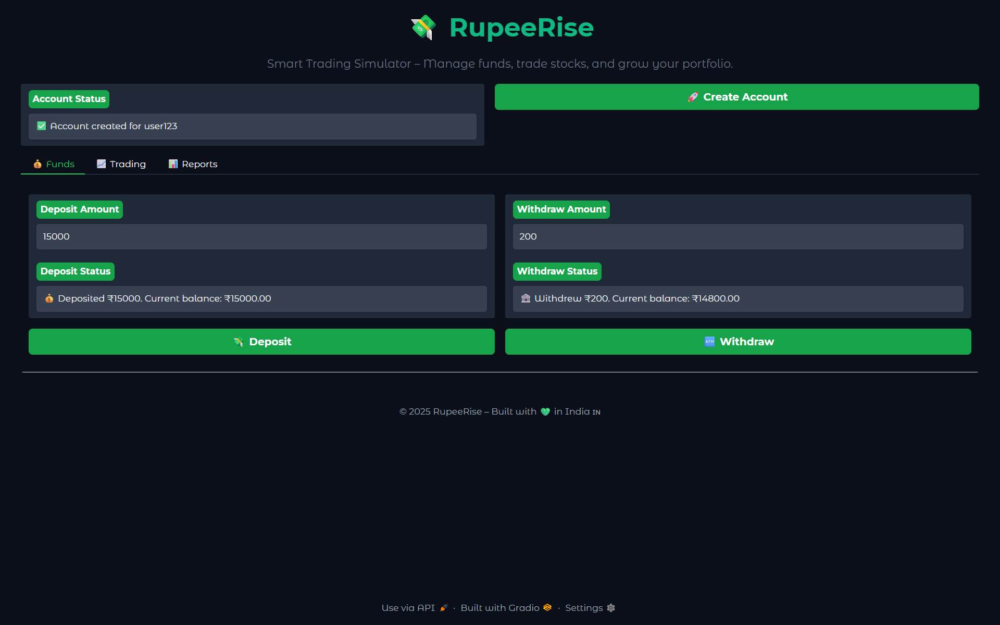
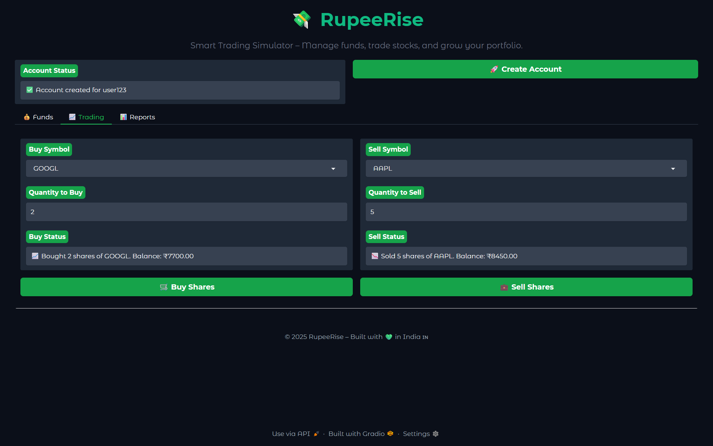
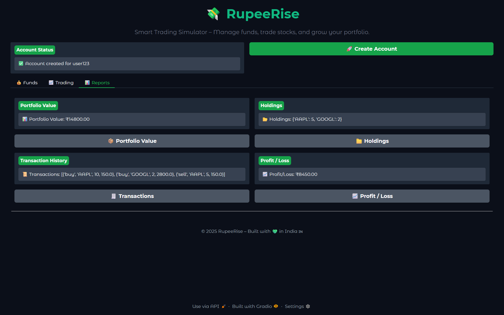

# 💼 RupeeRise – CrewAI Powered Trading Simulation

**RupeeRise** is not just another stock simulation app — it's a **demo use-case** of an intelligent agentic framework powered by **CrewAI**. It shows how autonomous AI agents can be assembled as a team to take any *high-level requirement* (like “build a trading app”) and automatically design, build, test, and demo the system — all in Python.

The current app simulates stock trading, but the **true power** lies in the backend: with just a change in the input requirement, the same CrewAI setup can generate **any kind of app or backend module**.

---

## ⚙️ Powered by Agentic Engineering

RupeeRise uses **four AI agents** working together:

1. **👷 Engineering Lead** – Creates a detailed design from high-level requirements  
2. **🧑‍💻 Backend Engineer** – Builds a fully working Python module from the design  
3. **🎨 Frontend Engineer** – Builds a Gradio UI for demonstration  
4. **✅ Test Engineer** – Writes automated test cases to validate the module  

All agents are orchestrated using the [CrewAI](https://docs.crewai.com/) framework with `sequential` task flow.

---

## 🖼 Interface Snapshots

  
*User interface for creating an account, managing funds*

  
*Buying and selling shares with fake market prices*

  
*Reports Page*

---

## 🧠 Architecture Overview

This project consists of:

| Component            | Description                                      |
|---------------------|--------------------------------------------------|
| `EngineeringTeam`   | The main crew that defines agents and tasks      |
| `agents.yaml`       | Defines each agent’s role, goal, and backstory   |
| `tasks.yaml`        | Defines each task and the workflow               |
| `rupeerise.py`      | The backend module generated by the crew         |
| `app.py`            | A Gradio UI to test and use the backend easily   |
| `test_rupeerise.py` | Unit tests auto-generated to validate backend    |

---

## 💡 How It Works (Step-by-Step)

1. You provide a high-level instruction (example: *“Build a stock trading simulation backend”*)
2. The `Engineering Lead` breaks it down into classes, methods, and logic
3. The `Backend Engineer` writes the actual Python code (`rupeerise.py`)
4. The `Frontend Engineer` builds a Gradio demo UI (`app.py`)
5. The `Test Engineer` writes unit tests (`test_rupeerise.py`)
6. You can run and test the app end-to-end — all components are generated!

---

## 🔁 Can Be Used For Any Requirement

While this repo uses **stock trading** as the sample problem, you can change the input requirement to anything like:

- 📦 Inventory tracking  
- 📝 Resume parser  
- 🧾 Bill generator  
- 🧠 Math solver  
- 📊 Portfolio tracker  

and the system will adapt and generate full backend + UI modules.

---

## 📂 File Structure

| File / Folder                | Description                                    |
|-----------------------------|------------------------------------------------|
| `config/agents.yaml`        | Agent roles, goals, and backstories            |
| `config/tasks.yaml`         | Tasks assigned to each agent                   |
| `rupeerise.py`              | Python backend module generated from design    |
| `app.py`                    | Gradio frontend to interact with backend       |
| `test_rupeerise.py`         | Unit tests to validate backend functionality   |
| `crew_engineering_team.py`  | Python class that defines the Crew and flow    |
| `assets/`                   | Screenshots and image assets for documentation |
| `requirements.txt`          | List of required Python packages               |
| `README.md`                 | This file                                      |

---

## 🧪 Requirements

Install the necessary packages:

```bash
pip install -r requirements.txt
```

Key dependencies include:

```txt
crewai
openai
gradio
python-dotenv
pandas
```

---

## 🚀 Run the App

To launch the Gradio interface:

```bash
python app.py
```

If you want to regenerate everything using the crew:

```bash
python crew_engineering_team.py
```

Make sure your `.env` contains your OpenAI API key:

```env
OPENAI_API_KEY=your-openai-api-key
```

---

## 📈 Summary

**RupeeRise** is just the beginning. With CrewAI's agentic workflow, this framework can build full software systems from natural language prompts — helping developers, learners, and product teams prototype ideas quickly and intelligently.

You don’t just build a trading app.
You build **anything** from a single line of instruction.

---

👨‍💻 Built by Dhanush Rudra  
🌐 Part of an ongoing exploration of AI-powered software engineering
